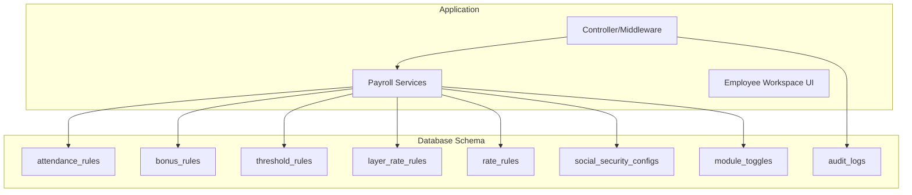
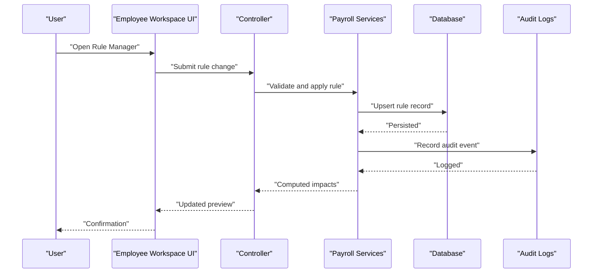
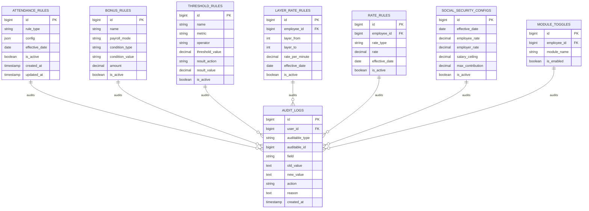

# Rule Manager Interface

<cite>
**Referenced Files in This Document**
- [0001_01_01_000008_create_rules_config_tables.php](file://database/migrations/0001_01_01_000008_create_rules_config_tables.php)
- [0001_01_01_000011_create_audit_logs_table.php](file://database/migrations/0001_01_01_000011_create_audit_logs_table.php)
- [AGENTS.md](file://AGENTS.md)
- [composer.json](file://composer.json)
</cite>

## Table of Contents
1. [Introduction](#introduction)
2. [Project Structure](#project-structure)
3. [Core Components](#core-components)
4. [Architecture Overview](#architecture-overview)
5. [Detailed Component Analysis](#detailed-component-analysis)
6. [Dependency Analysis](#dependency-analysis)
7. [Performance Considerations](#performance-considerations)
8. [Troubleshooting Guide](#troubleshooting-guide)
9. [Conclusion](#conclusion)
10. [Appendices](#appendices)

## Introduction
This document describes the Rule Manager interface used for business configuration and settings management within the payroll system. It covers rule categories, configuration forms, validation mechanisms, rule dependency management, and real-time impact assessment. It also outlines user workflows for adding, editing, and testing rule configurations, and documents the audit trail for rule changes and their implications on payroll calculations.

## Project Structure
The Rule Manager is implemented via database-first schema design with Laravel migrations. The system defines dedicated tables for each rule category and an audit log table to track changes. The project uses Laravel 13 with PHP 8.3 and standard package dependencies.

**Diagram sources**
- [0001_01_01_000008_create_rules_config_tables.php:11-101](file://database/migrations/0001_01_01_000008_create_rules_config_tables.php#L11-L101)
- [0001_01_01_000011_create_audit_logs_table.php:11-26](file://database/migrations/0001_01_01_000011_create_audit_logs_table.php#L11-L26)

**Section sources**
- [composer.json:8-12](file://composer.json#L8-L12)
- [0001_01_01_000008_create_rules_config_tables.php:1-103](file://database/migrations/0001_01_01_000008_create_rules_config_tables.php#L1-L103)
- [0001_01_01_000011_create_audit_logs_table.php:1-34](file://database/migrations/0001_01_01_000011_create_audit_logs_table.php#L1-L34)

## Core Components
The Rule Manager comprises the following rule categories and supporting infrastructure:

- Attendance rules: Configure late deductions, overtime rates, diligence, and grace periods with flexible JSON configuration and effective dates.
- Overtime (OT) rules: Define OT calculation modes, thresholds, and enable flags.
- Bonus rules: Define performance, attendance, or custom bonuses with amounts and payroll modes.
- Threshold rules: Define metric-based triggers (operators and threshold values) with actions affecting income or deductions.
- Layer rate rules: Define tiered rates per minute for freelancers with layer ranges and effective dates.
- Rate rules: Define fixed or hourly rates per employee with effective dates and activation flags.
- Social Security (SSO) rules: Configure employee/employer rates, salary ceilings, and maximum contributions with effective dates.
- Module toggles: Enable or disable features per employee with unique constraints.
- Audit logs: Track who changed what, when, and why, with foreign keys to users and auditable records.

Each rule includes:
- Status flags (active/inactive)
- Effective date boundaries
- Timestamps for creation/update
- Unique constraints where applicable (e.g., module toggles per employee)

**Section sources**
- [0001_01_01_000008_create_rules_config_tables.php:11-101](file://database/migrations/0001_01_01_000008_create_rules_config_tables.php#L11-L101)
- [0001_01_01_000011_create_audit_logs_table.php:11-26](file://database/migrations/0001_01_01_000011_create_audit_logs_table.php#L11-L26)

## Architecture Overview
The Rule Manager integrates with payroll services to compute pay items in real time. Controllers coordinate user actions, while services apply active rules to calculate earnings, deductions, and allowances. Audit logs capture all changes for compliance and traceability.

**Diagram sources**
- [0001_01_01_000008_create_rules_config_tables.php:11-101](file://database/migrations/0001_01_01_000008_create_rules_config_tables.php#L11-L101)
- [0001_01_01_000011_create_audit_logs_table.php:11-26](file://database/migrations/0001_01_01_000011_create_audit_logs_table.php#L11-L26)

## Detailed Component Analysis

### Attendance Rules
Purpose:
- Configure late deductions, overtime rates, diligence policies, and grace periods.
- Store flexible configuration in JSON for extensibility.

Fields and constraints:
- rule_type: categorical discriminator (e.g., late_deduction, ot_rate, diligence, grace_period)
- config: JSON payload containing rule-specific parameters
- effective_date: boundary for rule applicability
- is_active: enable/disable flag
- timestamps: created_at/updated_at

Validation and dependency management:
- Ensure only one active rule per rule_type per effective date range.
- Grace period affects late minute computation prior to applying per-minute penalties.
- Overtime rate depends on module toggle enabling OT processing.

Real-time impact:
- Late minutes exceeding grace period incur per-minute penalties.
- Overtime rates are applied when thresholds are met and OT module is enabled.

**Section sources**
- [0001_01_01_000008_create_rules_config_tables.php:71-78](file://database/migrations/0001_01_01_000008_create_rules_config_tables.php#L71-L78)
- [AGENTS.md:446-471](file://AGENTS.md#L446-L471)

### Overtime (OT) Rules
Purpose:
- Define OT calculation modes (by minute or hour), minimum thresholds, and enable flags.

Fields and constraints:
- Mode selection and threshold configuration stored in JSON or structured fields.
- Effective date and activation flag.
- Module toggle required to process OT.

Validation and dependency management:
- OT module toggle must be enabled.
- Threshold operator/value determines eligibility.
- Only one active OT rule per effective date range.

Real-time impact:
- Eligible OT hours/minutes are computed and paid according to selected mode and rate.

**Section sources**
- [0001_01_01_000008_create_rules_config_tables.php:71-78](file://database/migrations/0001_01_01_000008_create_rules_config_tables.php#L71-L78)
- [AGENTS.md:454-460](file://AGENTS.md#L454-L460)

### Bonus Rules
Purpose:
- Define performance, attendance, or custom bonuses with amounts and optional payroll modes.

Fields and constraints:
- name: rule identifier
- payroll_mode: optional mode scoping
- condition_type: performance, attendance, or custom
- condition_value: threshold or criteria
- amount: fixed bonus value
- is_active: enable/disable flag

Validation and dependency management:
- Ensure mutually exclusive or complementary conditions do not conflict.
- Apply only when conditions are met and rule is active.

Real-time impact:
- Adds income items to payslips when eligibility criteria are satisfied.

**Section sources**
- [0001_01_01_000008_create_rules_config_tables.php:37-46](file://database/migrations/0001_01_01_000008_create_rules_config_tables.php#L37-L46)

### Threshold Rules
Purpose:
- Trigger actions based on metrics (e.g., total hours, OT hours, late count) using operators and threshold values.

Fields and constraints:
- metric: target KPI (e.g., total_hours, ot_hours, late_count)
- operator: >=, <=, =, >, <
- threshold_value: numeric boundary
- result_action: add_income, add_deduction, set_value
- result_value: amount or new value
- is_active: enable/disable flag

Validation and dependency management:
- Prevent overlapping thresholds that conflict with the same metric/operator.
- Ensure only one active rule per metric/operator per effective date range.

Real-time impact:
- Adjusts income or deductions or sets values when thresholds are crossed.

**Section sources**
- [0001_01_01_000008_create_rules_config_tables.php:48-58](file://database/migrations/0001_01_01_000008_create_rules_config_tables.php#L48-L58)

### Layer Rate Rules
Purpose:
- Define tiered rates per minute for freelancers across layer ranges.

Fields and constraints:
- employee_id: foreign key to employees
- layer_from/to: inclusive minute ranges
- rate_per_minute: decimal rate with precision
- effective_date: boundary for applicability
- is_active: enable/disable flag

Validation and dependency management:
- Non-overlapping layer ranges per employee.
- Index on (employee_id, is_active) for efficient lookups.
- Only one active rule per effective date range per employee.

Real-time impact:
- Computes earnings by multiplying duration minutes by the applicable rate per minute within each layer.

**Section sources**
- [0001_01_01_000008_create_rules_config_tables.php:23-35](file://database/migrations/0001_01_01_000008_create_rules_config_tables.php#L23-L35)

### Rate Rules
Purpose:
- Define fixed or hourly rates per employee with effective dates and activation flags.

Fields and constraints:
- employee_id: foreign key to employees
- rate_type: fixed or hourly
- rate: decimal value
- effective_date: boundary for applicability
- is_active: enable/disable flag

Validation and dependency management:
- Only one active rule per effective date range per employee.
- Ensure rate_type is valid.

Real-time impact:
- Serves as baseline for salary or hourly wage computations.

**Section sources**
- [0001_01_01_000008_create_rules_config_tables.php:11-21](file://database/migrations/0001_01_01_000008_create_rules_config_tables.php#L11-L21)

### Social Security (SSO) Rules
Purpose:
- Configure Thailand social security parameters with effective dates.

Fields and constraints:
- effective_date: boundary for applicability
- employee_rate, employer_rate: percentages
- salary_ceiling: maximum taxable earnings
- max_contribution: cap on monthly contribution
- is_active: enable/disable flag

Validation and dependency management:
- Only one active rule per effective date range.
- Rates and ceilings validated against legal limits.

Real-time impact:
- Computes employee and employer contributions based on applicable parameters.

**Section sources**
- [0001_01_01_000008_create_rules_config_tables.php:60-69](file://database/migrations/0001_01_01_000008_create_rules_config_tables.php#L60-L69)
- [AGENTS.md:488-497](file://AGENTS.md#L488-L497)

### Module Toggles
Purpose:
- Enable or disable features per employee with unique constraints.

Fields and constraints:
- employee_id: foreign key to employees
- module_name: feature identifier
- is_enabled: enable/disable flag

Validation and dependency management:
- Unique constraint on (employee_id, module_name) prevents duplicates.
- Foreign key ensures referential integrity.

Real-time impact:
- Controls whether OT, SSO, or other modules participate in payroll calculations.

**Section sources**
- [0001_01_01_000008_create_rules_config_tables.php:80-89](file://database/migrations/0001_01_01_000008_create_rules_config_tables.php#L80-L89)

### Audit Logs
Purpose:
- Track who changed what, when, and why for compliance and traceability.

Fields and constraints:
- auditable_type: model class name
- auditable_id: primary key of audited record
- field: modified column (optional)
- old_value/new_value: serialized values
- action: created, updated, deleted, finalized, unfinalized
- reason: optional justification
- user_id: foreign key to users (nullable for system events)
- created_at: indexed timestamp

Validation and dependency management:
- Foreign key to users with ON DELETE SET NULL.
- Composite index on (auditable_type, auditable_id) and created_at for efficient queries.

Real-time impact:
- Provides immutable history for rule changes and their effects on payroll runs.

**Section sources**
- [0001_01_01_000011_create_audit_logs_table.php:11-26](file://database/migrations/0001_01_01_000011_create_audit_logs_table.php#L11-L26)

## Dependency Analysis
Rule Manager components interact as follows:

**Diagram sources**
- [0001_01_01_000008_create_rules_config_tables.php:11-101](file://database/migrations/0001_01_01_000008_create_rules_config_tables.php#L11-L101)
- [0001_01_01_000011_create_audit_logs_table.php:11-26](file://database/migrations/0001_01_01_000011_create_audit_logs_table.php#L11-L26)

**Section sources**
- [0001_01_01_000008_create_rules_config_tables.php:11-101](file://database/migrations/0001_01_01_000008_create_rules_config_tables.php#L11-L101)
- [0001_01_01_000011_create_audit_logs_table.php:11-26](file://database/migrations/0001_01_01_000011_create_audit_logs_table.php#L11-L26)

## Performance Considerations
- Indexes: Composite indexes on (employee_id, is_active) for layer_rate_rules and module_toggles improve lookup performance for active rules per employee.
- Effective date boundaries: Queries should filter by effective_date ranges to minimize scans.
- JSON fields: Keep attendance_rules.config minimal and normalized where possible to reduce parsing overhead.
- Audit log queries: Use created_at and auditable_type/auditable_id indexes for efficient filtering.
- Validation: Enforce uniqueness and non-overlapping constraints at the database level to avoid expensive post-insert checks.

[No sources needed since this section provides general guidance]

## Troubleshooting Guide
Common issues and resolutions:
- Overlapping thresholds: Ensure only one active threshold rule per metric/operator per effective date range.
- Conflicting layer ranges: Verify layer_from/to ranges do not overlap for the same employee.
- Missing module toggle: Confirm module toggles are enabled before expecting OT or SSO impacts.
- Audit trail gaps: Check user_id presence and ensure foreign key constraints are intact.

Audit trail review:
- Use auditable_type and auditable_id to locate rule changes.
- Filter by action and created_at to reconstruct timelines.
- Include reason for changes to support compliance reviews.

**Section sources**
- [0001_01_01_000011_create_audit_logs_table.php:11-26](file://database/migrations/0001_01_01_000011_create_audit_logs_table.php#L11-L26)

## Conclusion
The Rule Manager provides a robust, configurable foundation for payroll logic. Its schema-driven design supports real-time rule evaluation, comprehensive auditability, and modular feature controls. By enforcing validation and dependency rules at the database level and leveraging audit logs, the system ensures predictable and traceable impacts on payroll calculations.

[No sources needed since this section summarizes without analyzing specific files]

## Appendices

### User Workflows

#### Adding a New Rule
- Select rule category and fill configuration form.
- Set effective date and activation flag.
- Submit for validation; system checks uniqueness and dependency constraints.
- Review real-time impact preview before finalizing.

#### Editing an Existing Rule
- Modify parameters within allowed bounds.
- Deactivate old rule or adjust effective date to prevent conflicts.
- Re-validate dependencies and re-run impact assessment.

#### Testing Rule Configurations
- Use payslip preview to simulate payroll runs under various scenarios.
- Compare outcomes with and without specific rules enabled.
- Document changes with reasons captured in audit logs.

[No sources needed since this section provides general guidance]