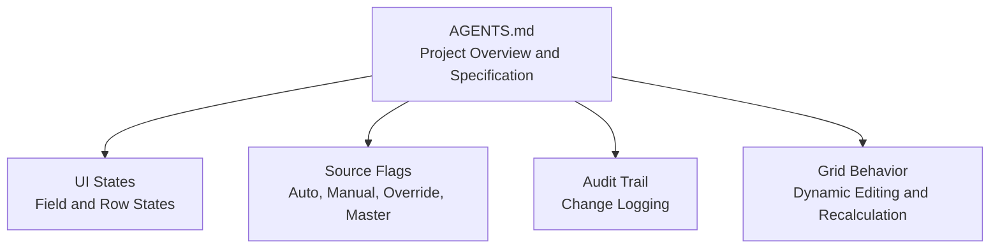
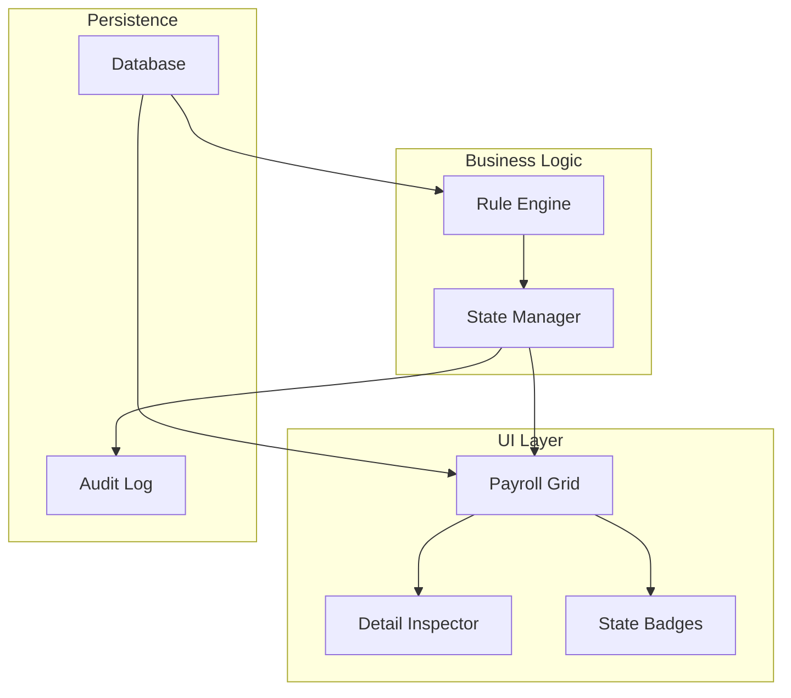
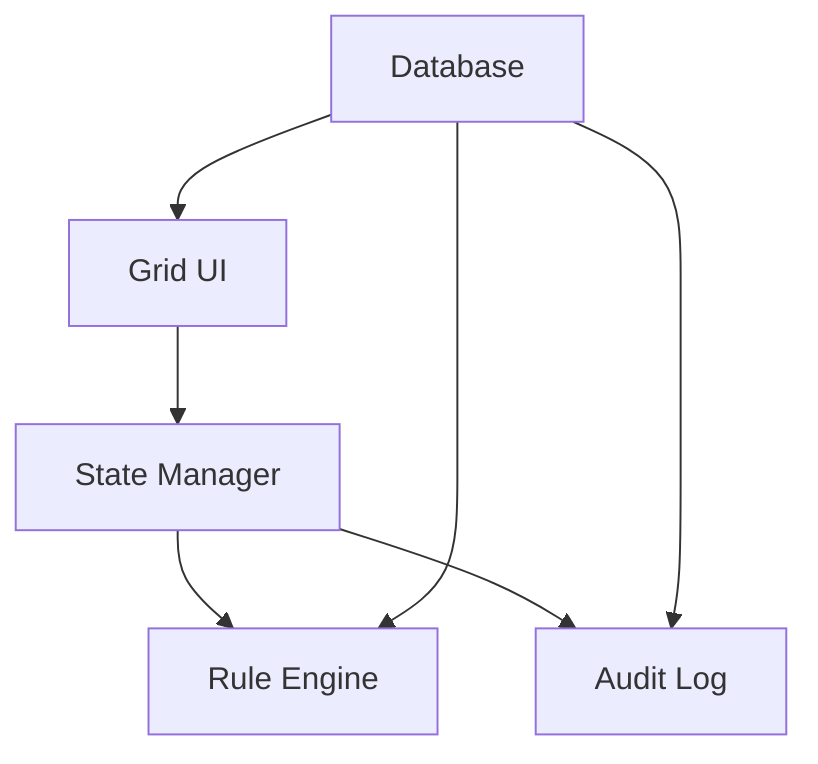

# State Management and Visual Indicators

<cite>
**Referenced Files in This Document**
- [AGENTS.md](file://AGENTS.md)
</cite>

## Table of Contents
1. [Introduction](#introduction)
2. [Project Structure](#project-structure)
3. [Core Components](#core-components)
4. [Architecture Overview](#architecture-overview)
5. [Detailed Component Analysis](#detailed-component-analysis)
6. [Dependency Analysis](#dependency-analysis)
7. [Performance Considerations](#performance-considerations)
8. [Troubleshooting Guide](#troubleshooting-guide)
9. [Conclusion](#conclusion)
10. [Appendices](#appendices)

## Introduction
This document describes the state management system and visual indicators used in the payroll workspace. It explains how field and row states are represented in the grid interface, how the source flag system is displayed to users, and how state transitions occur. It also outlines user feedback mechanisms and the audit trail integration that tracks state changes. Accessibility considerations for state visualization and screen reader compatibility are addressed to ensure inclusive user experiences.

## Project Structure
The repository contains a single project overview and specification document that defines the state model, UI expectations, and audit requirements for the payroll system. The document specifies the required UI states and source flags, along with the dynamic grid behavior and audit logging requirements.

**Diagram sources**
- [AGENTS.md](file://AGENTS.md)

**Section sources**
- [AGENTS.md](file://AGENTS.md)

## Core Components
This section documents the state model and visual indicators as defined in the specification.

- Field and row states
  - locked: Indicates a field or row is not editable.
  - auto: Indicates a value is generated automatically by the system.
  - manual: Indicates a value was entered manually by the user.
  - override: Indicates a value was overridden for a specific month.
  - from_master: Indicates a value originates from the master profile.
  - rule_applied: Indicates a value resulted from applying a configured rule.
  - draft: Indicates a record is in draft state prior to finalization.
  - finalized: Indicates a record has been finalized and is snapshotted.

- Source flags
  - auto: Value computed automatically.
  - manual: Value entered by the user.
  - override: Monthly override applied.
  - master: Value from the master profile.

- Visual presentation in the grid
  - Badges: Each field or row displays a small badge indicating its state.
  - Color coding: States are visually encoded with distinct colors for quick recognition.
  - Visual cues: Additional cues (e.g., icons or emphasis) complement badges to improve clarity.

- Detail inspector
  - When a user selects a row, the inspector shows:
    - Source of the value (auto/manual/override/master).
    - Formula or rule source.
    - Whether the value is monthly-only or master.
    - Notes/reasons for changes.
    - Audit history for that row.

**Section sources**
- [AGENTS.md:528-546](file://AGENTS.md#L528-L546)
- [AGENTS.md:528-538](file://AGENTS.md#L528-L538)
- [AGENTS.md:540-546](file://AGENTS.md#L540-L546)

## Architecture Overview
The state management system integrates with the payroll grid, rule engine, and audit logging subsystems. The grid presents state badges and source flags, while the rule engine applies values and marks states accordingly. The audit trail captures all state changes for compliance and traceability.

[No sources needed since this diagram shows conceptual workflow, not actual code structure]

## Detailed Component Analysis

### State Badge System
- Purpose: Provide immediate, at-a-glance visibility of a field or row’s current state.
- Presentation:
  - Badges are displayed alongside each field or row in the grid.
  - Each state has a distinct label and color scheme.
  - Hover or click reveals additional context in the inspector.

- State definitions and visual encoding:
  - locked: Typically muted or disabled appearance.
  - auto: Distinct color for auto-generated values.
  - manual: Distinct color for user-entered values.
  - override: Distinct color for monthly overrides.
  - from_master: Distinct color for values originating from master.
  - rule_applied: Distinct color for values resulting from rules.
  - draft: Light or neutral color indicating draft.
  - finalized: Bold or prominent color indicating finalized.

- Accessibility:
  - Ensure color is not the sole indicator; include text labels and ARIA attributes.
  - Provide keyboard navigation and focus styles for badges.
  - Screen readers announce state labels and roles.

**Section sources**
- [AGENTS.md:528-538](file://AGENTS.md#L528-L538)
- [AGENTS.md:540-546](file://AGENTS.md#L540-L546)

### Source Flag System
- Purpose: Clarify the origin of each value to support transparency and traceability.
- Flags:
  - auto: Value computed automatically by the system.
  - manual: Value entered by the user.
  - override: Monthly override applied.
  - master: Value from the master profile.

- Display:
  - Source flags are shown as badges or labels near the value.
  - The inspector augments this with rule formulas and enablement flags.

- User feedback:
  - When a user edits a value, the system should reflect the new source flag.
  - Clear messaging indicates whether changes are saved as monthly overrides or master updates.

**Section sources**
- [AGENTS.md:86-88](file://AGENTS.md#L86-L88)
- [AGENTS.md:241-243](file://AGENTS.md#L241-L243)
- [AGENTS.md:525-527](file://AGENTS.md#L525-L527)

### State Transitions
- Transition triggers:
  - Editing a field: moves from locked to manual or override depending on context.
  - Applying a rule: moves from locked to rule_applied.
  - Saving a value: persists the state and updates the audit trail.
  - Finalizing a payslip: moves records to finalized and snapshots data.

- Transition rules:
  - Auto values remain auto unless explicitly overridden.
  - Manual entries can be overridden monthly.
  - Overrides are specific to the selected month.
  - Draft-to-finalized transitions require permission and validation.

- User feedback:
  - Immediate visual feedback upon state changes.
  - Tooltip or status bar messages indicate the new state and its implications.

**Section sources**
- [AGENTS.md:498-505](file://AGENTS.md#L498-L505)
- [AGENTS.md:514-515](file://AGENTS.md#L514-L515)

### Audit Trail Integration
- What to log:
  - Who changed what, when, and why.
  - Old and new values for each field.
  - Action type (edit, finalize, unfinalize).
  - Optional reason or note.

- High-priority audit areas:
  - Employee salary profile changes.
  - Payroll item amount changes.
  - Payslip finalize/unfinalize actions.
  - Rule changes and module toggle changes.
  - SSO configuration changes.

- Integration with UI:
  - The inspector shows audit history for a selected row.
  - Users can add notes or reasons during edits to enrich the audit trail.

**Section sources**
- [AGENTS.md:576-595](file://AGENTS.md#L576-L595)
- [AGENTS.md:319-320](file://AGENTS.md#L319-L320)
- [AGENTS.md:540-546](file://AGENTS.md#L540-L546)

### Grid Behavior and Visual Cues
- Dynamic editing:
  - Inline editing with instant recalculation.
  - Add/remove/duplicate rows with appropriate state propagation.
  - Dropdowns and category selectors update state badges accordingly.

- Visual cues:
  - Color-coded badges for quick scanning.
  - Emphasis on finalized or overridden rows.
  - Tooltips for hover states explaining the meaning of each badge.

- Accessibility:
  - Keyboard navigation to badges and rows.
  - Focus indicators and readable contrast ratios.
  - Screen reader announcements for state and source changes.

**Section sources**
- [AGENTS.md:516-527](file://AGENTS.md#L516-L527)
- [AGENTS.md:540-546](file://AGENTS.md#L540-L546)

## Dependency Analysis
The state management system depends on the rule engine for automatic values, the grid for user interactions, and the audit subsystem for change tracking. The following conceptual dependency diagram illustrates these relationships.

[No sources needed since this diagram shows conceptual relationships, not actual code structure]

## Performance Considerations
- Badge rendering:
  - Minimize DOM updates by batching state changes.
  - Use virtualization for large grids to keep rendering responsive.

- Recalculation:
  - Debounce recalculations during rapid edits.
  - Invalidate only affected rows to reduce computation.

- Audit logging:
  - Batch log writes to reduce I/O overhead.
  - Asynchronous logging for non-blocking user experience.

[No sources needed since this section provides general guidance]

## Troubleshooting Guide
- State badge not updating:
  - Verify the state manager is invoked after edits.
  - Check for client-side caching or stale UI state.

- Incorrect source flag:
  - Confirm whether the change was saved as monthly override or master.
  - Review rule application logic for auto vs. manual assignments.

- Audit trail missing:
  - Ensure the audit log service is enabled and reachable.
  - Verify permissions for writing audit entries.

- Accessibility issues:
  - Test with screen readers to confirm state announcements.
  - Validate keyboard navigation and focus management.

**Section sources**
- [AGENTS.md:576-595](file://AGENTS.md#L576-L595)
- [AGENTS.md:540-546](file://AGENTS.md#L540-L546)

## Conclusion
The state management system provides clear, accessible, and auditable visibility into payroll data. By combining state badges, source flags, and a robust audit trail, users can confidently manage payroll entries while maintaining compliance and traceability. The grid’s dynamic behavior and visual cues enhance usability, while accessibility features ensure inclusivity for all users.

[No sources needed since this section summarizes without analyzing specific files]

## Appendices
- Glossary of states and flags:
  - locked, auto, manual, override, from_master, rule_applied, draft, finalized
  - auto, manual, override, master

- Recommended UI patterns:
  - Consistent color coding and labeling.
  - Clear tooltips and keyboard navigation.
  - Accessible contrast and ARIA attributes.

[No sources needed since this section provides general guidance]