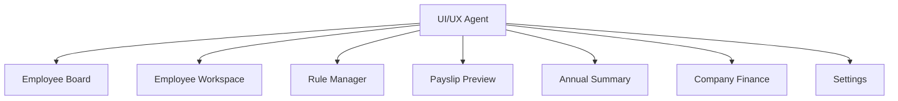
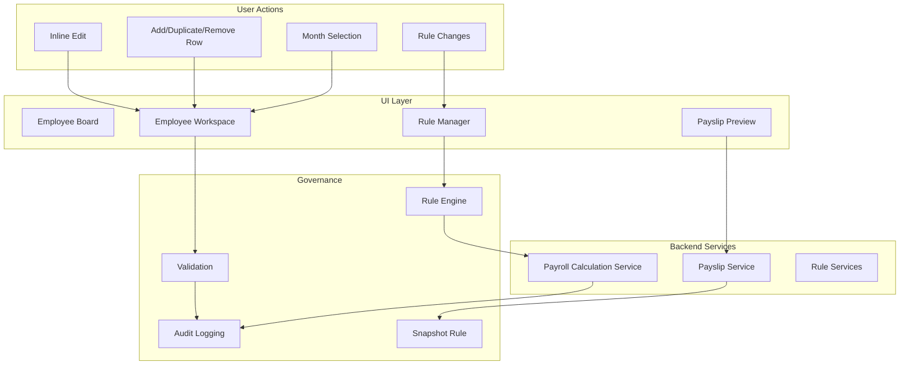
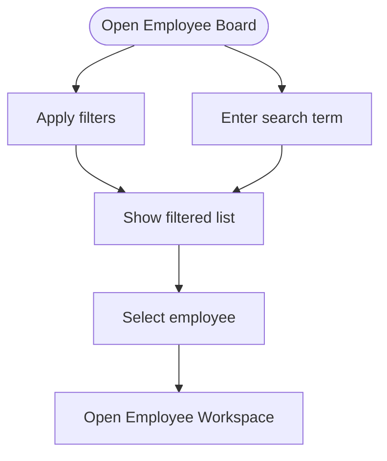
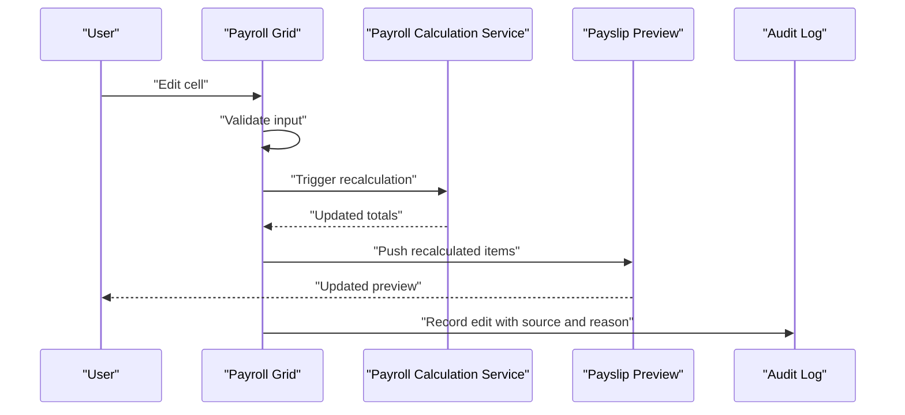
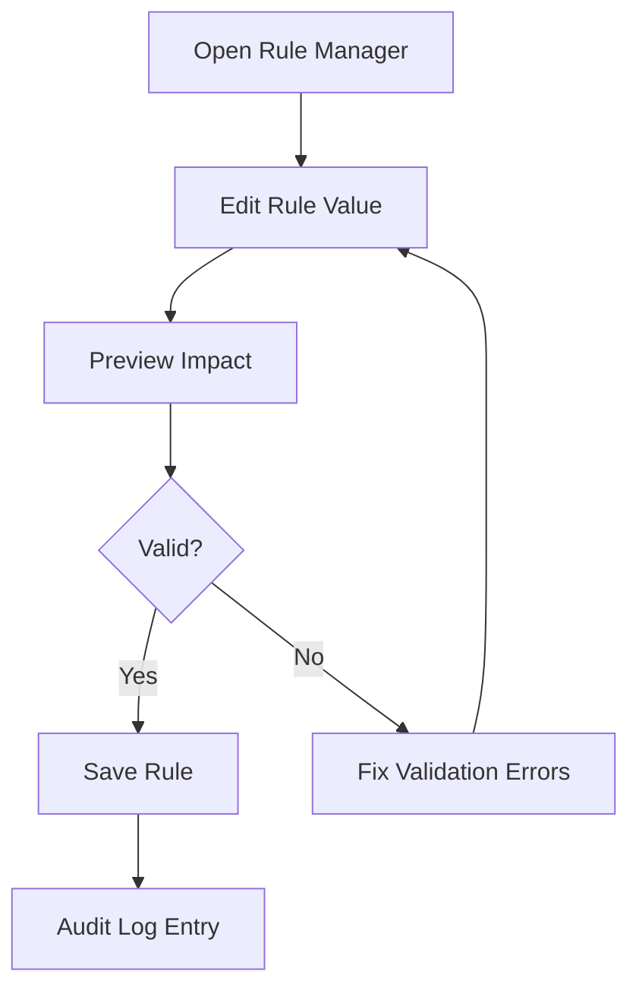
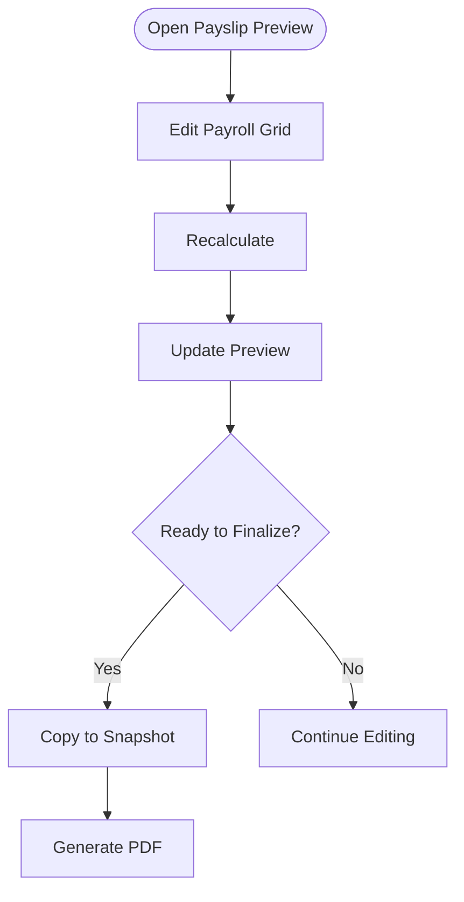
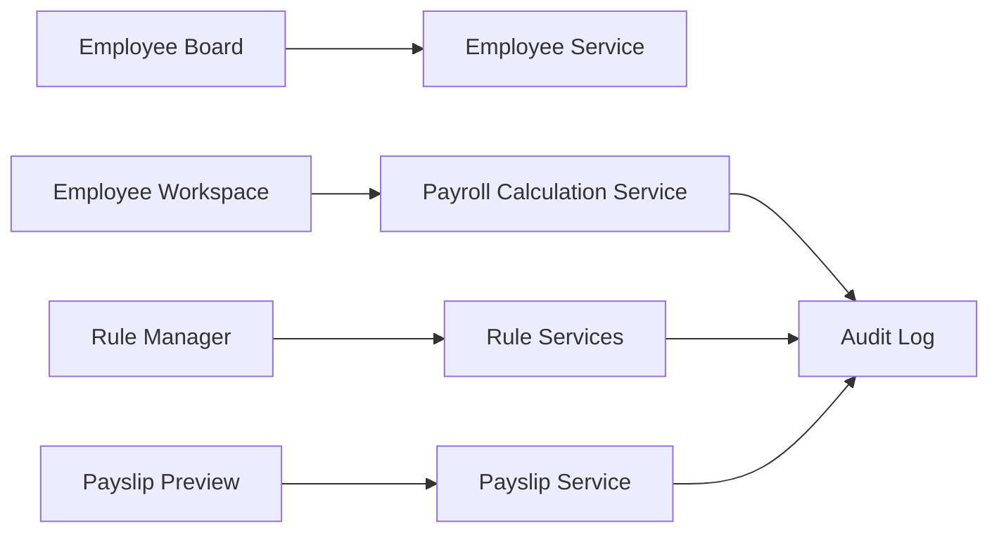

# User Interface and Experience

<cite>
**Referenced Files in This Document**
- [AGENTS.md](file://AGENTS.md)
</cite>

## Table of Contents
1. [Introduction](#introduction)
2. [Project Structure](#project-structure)
3. [Core Components](#core-components)
4. [Architecture Overview](#architecture-overview)
5. [Detailed Component Analysis](#detailed-component-analysis)
6. [Dependency Analysis](#dependency-analysis)
7. [Performance Considerations](#performance-considerations)
8. [Troubleshooting Guide](#troubleshooting-guide)
9. [Conclusion](#conclusion)
10. [Appendices](#appendices)

## Introduction
This document describes the user interface and experience design for the xHR Payroll & Finance System. It focuses on the main interface components—Employee Board, Employee Workspace, Rule Manager, and Payslip Preview—and documents dynamic UI behaviors such as inline editing, real-time calculation feedback, state management indicators, and responsive design patterns. It also explains the grid-based payroll interface that mimics Excel functionality while maintaining strict data governance, and provides user workflow documentation, accessibility considerations, and performance optimization guidance for large datasets, including mobile responsiveness and touch interaction patterns.

## Project Structure
The repository currently contains a single specification document that defines the system’s UI/UX expectations, component responsibilities, and behavioral rules. The UI/UX Agent is responsible for designing screens that feel like a spreadsheet while enforcing backend governance and auditability.

**Section sources**
- [AGENTS.md:222-244](file://AGENTS.md#L222-L244)

## Core Components
This section outlines the primary user-facing components and their intended roles, behaviors, and state indicators.

- Employee Board
  - Purpose: Browse employees, search, filter, and open an employee workspace.
  - Behaviors: Card/grid list, search, filter by role/status/mode, add employee, open workspace.
  - Accessibility: Keyboard navigation, screen reader-friendly labels, focus management.
  - Responsive: Collapsible filters, stacked layout on small screens, touch-friendly buttons.

- Employee Workspace
  - Purpose: Central editing surface for payroll entries and previews.
  - Components:
    - Header with month selector and summary cards
    - Main payroll grid (inline editing, add/remove/duplicate rows)
    - Detail inspector (source, formula/rule source, monthly vs master, notes, audit history)
    - Payslip preview panel
    - Audit timeline
  - Behaviors: Inline editing, instant recalculation, source badges, state indicators.
  - Accessibility: Clear state labels, keyboard shortcuts for grid actions, ARIA live regions for feedback.

- Rule Manager
  - Purpose: Configure rules for attendance, OT, bonuses, thresholds, layer rates, SSO, taxes, and module toggles.
  - Behaviors: Real-time preview of rule effects, validation feedback, save with audit trail.
  - Accessibility: Grouped controls, clear headings, error announcements.

- Payslip Preview
  - Purpose: Real-time preview of the generated payslip before finalization.
  - Behaviors: Immediate reflection of edits, snapshot rule compliance, export and finalize actions.
  - Accessibility: Structured layout, readable totals, clear “Finalize” affordances.

**Section sources**
- [AGENTS.md:228-244](file://AGENTS.md#L228-L244)
- [AGENTS.md:303-321](file://AGENTS.md#L303-L321)
- [AGENTS.md:344-353](file://AGENTS.md#L344-L353)
- [AGENTS.md:354-359](file://AGENTS.md#L354-L359)

## Architecture Overview
The UI/UX design is governed by strict separation of concerns and data governance. The UI must feel like a spreadsheet but must never bypass backend validation, audit, or rule enforcement.

**Section sources**
- [AGENTS.md:222-244](file://AGENTS.md#L222-L244)
- [AGENTS.md:498-506](file://AGENTS.md#L498-L506)
- [AGENTS.md:567-573](file://AGENTS.md#L567-L573)

## Detailed Component Analysis

### Employee Board
- Layout and Navigation
  - Grid/list view with search and filter controls.
  - Add employee button and quick-open to workspace.
- Interaction Patterns
  - Click-to-open workspace, keyboard navigation for list items.
  - Filter chips with clear-all affordance.
- Accessibility
  - Screen-reader-friendly labels for filters and actions.
  - Focus indicators and skip links.
- Responsive Design
  - Collapsible filter sidebar on small screens.
  - Stacked layout for cards and search bar.

**Section sources**
- [AGENTS.md:303-309](file://AGENTS.md#L303-L309)

### Employee Workspace
- Header
  - Month selector with previous/next navigation.
  - Summary cards for quick insights (e.g., total income, deductions, net pay).
- Main Payroll Grid
  - Inline editing with immediate recalculation.
  - Row actions: add, duplicate, remove.
  - Dropdowns for type/category.
  - Auto amount calculation with manual override capability.
  - Source badges indicating locked/auto/manual/override/master.
- Detail Inspector
  - On row click: show source, formula/rule source, monthly-only vs master, notes, audit history.
- Payslip Preview Panel
  - Real-time preview reflecting grid changes.
  - Export and finalize actions.
- Audit Timeline
  - Chronological view of edits and approvals.

**Section sources**
- [AGENTS.md:310-321](file://AGENTS.md#L310-L321)
- [AGENTS.md:513-515](file://AGENTS.md#L513-L515)
- [AGENTS.md:528-538](file://AGENTS.md#L528-L538)

### Rule Manager
- Capabilities
  - Manage rules for attendance, OT, bonuses, thresholds, layer rates, SSO, taxes, and module toggles.
  - Real-time preview of rule effects on payroll calculations.
  - Validation feedback and save with audit trail.
- UX Behaviors
  - Grouped controls with clear headings.
  - Instant feedback when toggling modules or changing rule values.
  - Error announcements and guidance tooltips.

**Section sources**
- [AGENTS.md:344-353](file://AGENTS.md#L344-L353)

### Payslip Preview
- Structure
  - Company header, employee details, month, payment date, bank info, income and deduction columns, totals, signatures.
- Behavior
  - Immediate reflection of grid edits.
  - Snapshot rule: finalized payslip items are copied to a stable snapshot for PDF generation.
- Accessibility
  - Structured layout with clear totals and signature placeholders.
  - Finalize action clearly labeled and reachable via keyboard.

**Section sources**
- [AGENTS.md:549-573](file://AGENTS.md#L549-L573)

## Dependency Analysis
The UI depends on backend services for validation, rule evaluation, and audit logging. The UI must never bypass governance.

**Section sources**
- [AGENTS.md:636-647](file://AGENTS.md#L636-L647)
- [AGENTS.md:576-595](file://AGENTS.md#L576-L595)

## Performance Considerations
- Large Datasets
  - Virtual scrolling for the payroll grid to limit DOM nodes.
  - Debounced recalculation to avoid excessive backend calls during rapid edits.
  - Pagination or lazy loading for audit timelines.
- Rendering
  - Batch updates to the grid to minimize reflows.
  - Memoization of rule evaluations keyed by inputs.
- Mobile Responsiveness
  - Touch-friendly targets (minimum 44px), swipe gestures for row actions.
  - Collapsible panels and stacked layouts on small screens.
  - Optimized font sizes and spacing for readability.

[No sources needed since this section provides general guidance]

## Troubleshooting Guide
- Inline Editing Issues
  - Symptom: Edits do not trigger recalculation.
  - Action: Verify validation passes and the grid is not locked; check for audit flags preventing edits.
- State Indicators
  - Symptom: Confusion about whether a value is auto/manual/override.
  - Action: Inspect the detail inspector for source and state badges; confirm with audit timeline.
- Finalization Problems
  - Symptom: Cannot finalize payslip.
  - Action: Ensure all required fields are set and totals reconcile; review snapshot rule compliance.
- Rule Changes Not Applied
  - Symptom: Rule changes do not affect payroll.
  - Action: Confirm rule is enabled and saved; verify recalculation was triggered; check audit logs for errors.

**Section sources**
- [AGENTS.md:528-538](file://AGENTS.md#L528-L538)
- [AGENTS.md:567-573](file://AGENTS.md#L567-L573)
- [AGENTS.md:576-595](file://AGENTS.md#L576-L595)

## Conclusion
The xHR Payroll & Finance System’s UI/UX is designed to deliver a familiar spreadsheet-like experience while enforcing strict data governance, auditability, and maintainability. By adhering to the outlined components, behaviors, and accessibility guidelines, the system ensures efficient payroll operations, reliable data integrity, and a smooth user experience across devices.

[No sources needed since this section summarizes without analyzing specific files]

## Appendices
- User Workflow Summary
  - Login → Dashboard → Employee Board → Select Employee → Employee Workspace → Edit Grid → Recalculate → Preview Slip → Save → Finalize
- Accessibility Checklist
  - Keyboard navigation, ARIA labels, focus management, screen reader compatibility, color contrast, and error announcements.
- Mobile Touch Interactions
  - Tap targets ≥ 44px, swipe to expand/collapse panels, pinch-to-zoom disabled for grid, persistent top-level navigation.

**Section sources**
- [AGENTS.md:510-515](file://AGENTS.md#L510-L515)
- [AGENTS.md:222-244](file://AGENTS.md#L222-L244)