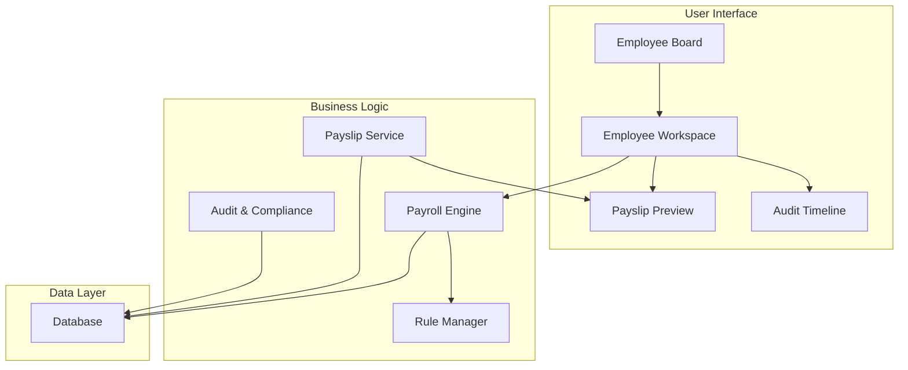
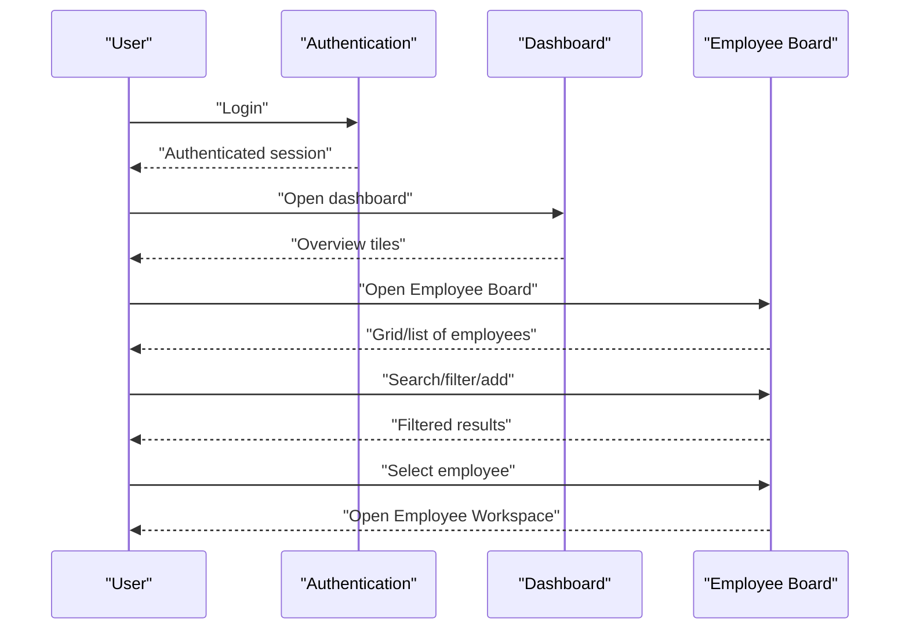
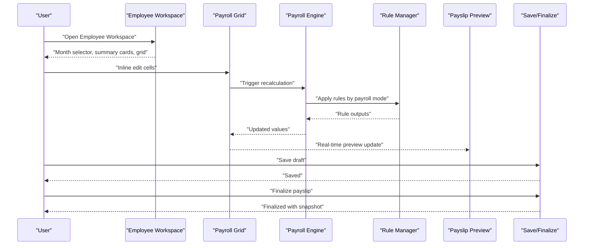
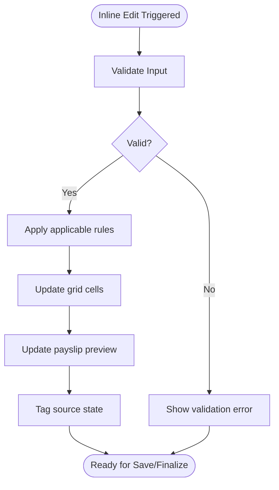
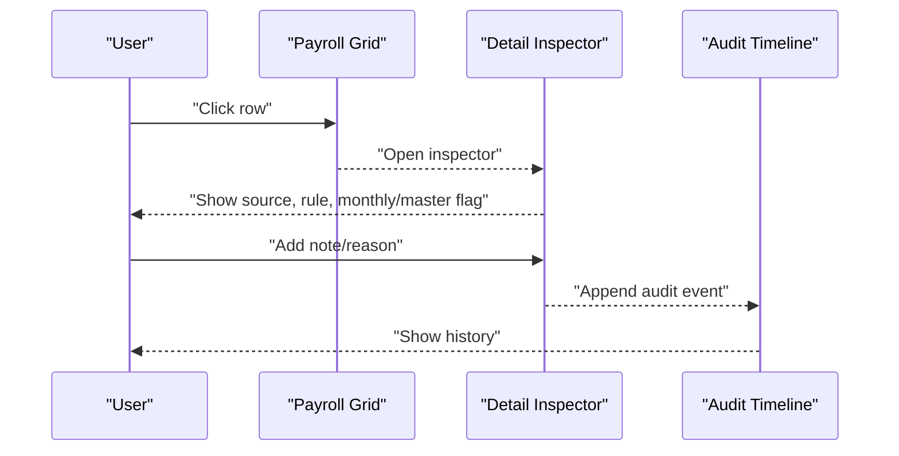
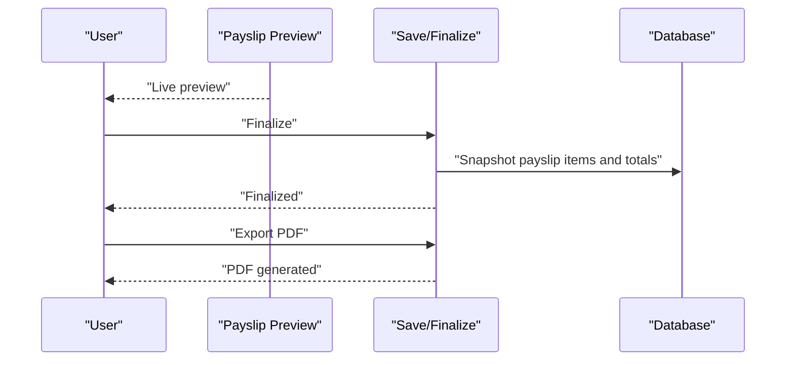
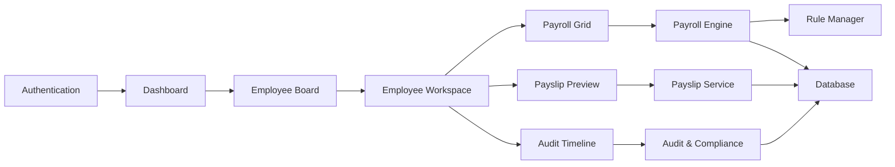

# User Workflows and Interaction Patterns

<cite>
**Referenced Files in This Document**
- [AGENTS.md](file://AGENTS.md)
</cite>

## Table of Contents
1. [Introduction](#introduction)
2. [Project Structure](#project-structure)
3. [Core Components](#core-components)
4. [Architecture Overview](#architecture-overview)
5. [Detailed Component Analysis](#detailed-component-analysis)
6. [Dependency Analysis](#dependency-analysis)
7. [Performance Considerations](#performance-considerations)
8. [Troubleshooting Guide](#troubleshooting-guide)
9. [Conclusion](#conclusion)
10. [Appendices](#appendices)

## Introduction
This document maps the end-to-end user interaction patterns and workflow sequences for the xHR Payroll system. It focuses on two primary journeys:
- Employee Board flow: Login through dashboard to employee selection
- Payroll entry flow: From Employee Workspace, through grid editing and recalculation, payslip preview, saving, and finalization

It also documents inline editing behaviors, real-time calculation feedback, immediate payslip preview, user journey mapping, task completion patterns, error handling and recovery mechanisms, plus mobile responsiveness, touch interaction patterns, keyboard navigation, and accessibility features.

## Project Structure
The repository provides a comprehensive functional specification and design blueprint for the xHR Payroll system. While the actual application code is not present in this workspace, the specification defines the intended user workflows, UI modules, and interaction behaviors that drive the system’s user experience.

Key modules and their roles:
- Authentication: login, logout, role/permission
- Employee Management: add/edit/activate/deactivate, assign payroll mode, departments/positions, bank info, SSO eligibility
- Employee Board: card/grid list, search, filters, add employee, open workspace
- Employee Workspace: header, month selector, summary cards, main payroll grid, detail inspector, payslip preview, audit timeline
- Attendance Module: check-in/out style input, late minutes, early leave, OT enabled, LWOP flag
- Work Log Module: date, work type, qty/minutes/seconds, layer, rate, amount
- Payroll Engine: calculate by payroll mode, aggregate income/deductions, support manual override, produce payroll result snapshot
- Rule Manager: attendance rules, OT rules, bonus rules, threshold rules, layer rate rules, SSO rules, tax rules, module toggles
- Payslip Module: preview, finalize, export PDF, regenerate from finalized data only by permission
- Annual Summary: 12-month view, employee summary, annual totals, export
- Company Finance Summary: revenue, expenses, P&L, cumulative, quarterly, tax simulation
- Subscription & Extra Costs: recurring software, fixed costs, equipment, dubbing, other business expenses

These modules collectively define the user-facing flows documented below.

**Section sources**
- [AGENTS.md:286-382](file://AGENTS.md#L286-L382)

## Core Components
This section outlines the core components that underpin user workflows and interaction patterns.

- Authentication and Authorization
  - Login/logout and role/permission controls govern access to modules and actions.
  - Permissions ensure users can only perform authorized payroll edits and finalizations.

- Employee Board
  - Presents a searchable, filterable grid/list of employees.
  - Supports adding new employees and opening the Employee Workspace for selected employees.

- Employee Workspace
  - Central editing surface with:
    - Month selector
    - Summary cards
    - Main payroll grid supporting inline editing, add/remove/duplicate rows, dropdowns, auto-calculation, manual overrides, and recalculation
    - Detail inspector showing source, formulas/rules, monthly vs master, notes/reasons, and audit history
    - Payslip preview panel
    - Audit timeline

- Payroll Engine and Rule Manager
  - Rule-driven calculations by payroll mode (monthly staff, freelance layer, freelance fixed, youtuber salary/settlement, custom hybrid)
  - Real-time recalculation upon inline edits and row changes
  - Support for manual overrides with explicit source tagging

- Payslip Module
  - Immediate preview after recalculation
  - Finalization snapshots and PDF export
  - Regeneration restricted to finalized data with permissions

- Audit and Compliance
  - Comprehensive audit logging for all significant changes (salary profile, payroll items, payslip edits/finalize, rule/module/config changes)

**Section sources**
- [AGENTS.md:288-359](file://AGENTS.md#L288-L359)
- [AGENTS.md:438-506](file://AGENTS.md#L438-L506)
- [AGENTS.md:576-595](file://AGENTS.md#L576-L595)

## Architecture Overview
The system is designed around a rule-driven, record-based payroll engine with a dynamic, spreadsheet-like UI. The architecture supports:
- Real-time calculation feedback during inline editing
- Immediate payslip preview
- Explicit source tagging for transparency
- Auditability and compliance
- Modular rule management

[No sources needed since this diagram shows conceptual architecture, not actual code structure]

## Detailed Component Analysis

### Employee Board Flow: Login to Employee Selection
The Employee Board flow guides users from login through dashboard to selecting an employee for payroll work.

**Diagram sources**
- [AGENTS.md:510-511](file://AGENTS.md#L510-L511)

**Section sources**
- [AGENTS.md:288-309](file://AGENTS.md#L288-L309)

### Payroll Entry Flow: Workspace to Finalization
The Payroll entry flow covers editing, recalculation, preview, save, and finalization.

**Diagram sources**
- [AGENTS.md:513-514](file://AGENTS.md#L513-L514)
- [AGENTS.md:310-321](file://AGENTS.md#L310-L321)
- [AGENTS.md:338-343](file://AGENTS.md#L338-L343)
- [AGENTS.md:344-352](file://AGENTS.md#L344-L352)
- [AGENTS.md:354-359](file://AGENTS.md#L354-L359)

**Section sources**
- [AGENTS.md:310-321](file://AGENTS.md#L310-L321)
- [AGENTS.md:338-343](file://AGENTS.md#L338-L343)
- [AGENTS.md:344-352](file://AGENTS.md#L344-L352)
- [AGENTS.md:354-359](file://AGENTS.md#L354-L359)

### Inline Editing Behaviors and Real-Time Feedback
- Inline editing allows direct cell updates within the payroll grid.
- Real-time recalculation updates dependent fields and summary cards.
- Immediate payslip preview reflects the latest edits.
- Source badges indicate whether values are locked, auto-generated, manually entered, overridden, from master, or rule-applied.

**Diagram sources**
- [AGENTS.md:516-527](file://AGENTS.md#L516-L527)
- [AGENTS.md:528-538](file://AGENTS.md#L528-L538)

**Section sources**
- [AGENTS.md:516-538](file://AGENTS.md#L516-L538)

### Detail Inspector and Audit Transparency
- Clicking a row opens the Detail Inspector.
- Displays source, formula/rule source, monthly-only vs master, notes/reasons, and audit history for that row.

**Diagram sources**
- [AGENTS.md:539-546](file://AGENTS.md#L539-L546)

**Section sources**
- [AGENTS.md:539-546](file://AGENTS.md#L539-L546)

### Payslip Preview and Finalization
- Preview updates immediately after recalculation.
- Finalization creates a snapshot of items, totals, and rendering metadata for PDF generation.
- Regeneration of payslips is restricted to finalized data and requires appropriate permissions.

**Diagram sources**
- [AGENTS.md:562-573](file://AGENTS.md#L562-L573)
- [AGENTS.md:354-359](file://AGENTS.md#L354-L359)

**Section sources**
- [AGENTS.md:562-573](file://AGENTS.md#L562-L573)
- [AGENTS.md:354-359](file://AGENTS.md#L354-L359)

### Accessibility, Mobile Responsiveness, and Keyboard Navigation
- Spreadsheet-like editing expectations: inline editing, add/remove/duplicate rows, dropdowns, instant recalculation, immediate preview.
- Accessibility features include:
  - Clear labeling and state indicators (locked, auto, manual, override, from_master, rule_applied, draft, finalized)
  - Audit visibility for traceability
  - Keyboard navigation to move between cells and rows
  - Touch-friendly controls for mobile devices
- Mobile responsiveness ensures that:
  - Grid columns adapt to viewport width
  - Controls scale appropriately
  - Tap targets maintain adequate size for touch interaction

**Section sources**
- [AGENTS.md:222-244](file://AGENTS.md#L222-L244)
- [AGENTS.md:516-538](file://AGENTS.md#L516-L538)

## Dependency Analysis
The user workflows depend on cohesive modules with clear boundaries and explicit interactions.

[No sources needed since this diagram shows conceptual dependencies, not actual code structure]

**Section sources**
- [AGENTS.md:288-359](file://AGENTS.md#L288-L359)
- [AGENTS.md:338-359](file://AGENTS.md#L338-L359)
- [AGENTS.md:576-595](file://AGENTS.md#L576-L595)

## Performance Considerations
- Real-time recalculation should be optimized to avoid excessive database queries and heavy client-side computations.
- Batch updates and debounced recalculations can improve responsiveness during rapid inline edits.
- Caching frequently accessed rule configurations and lookup data reduces latency.
- Efficient grid rendering and virtualization help maintain smooth scrolling and editing on large datasets.

[No sources needed since this section provides general guidance]

## Troubleshooting Guide
Common issues and recovery mechanisms:
- Validation errors during inline editing:
  - Display targeted messages near invalid fields.
  - Prevent save/finalize until corrections are made.
- Recalculation anomalies:
  - Verify rule applicability and precedence.
  - Re-run recalculation after fixing conflicting overrides.
- Audit discrepancies:
  - Review audit timeline for the affected row.
  - Confirm source flags and reasons recorded.
- Finalization problems:
  - Ensure all required fields are set and validated.
  - Re-export PDF if rendering metadata changed.

**Section sources**
- [AGENTS.md:578-595](file://AGENTS.md#L578-L595)

## Conclusion
The xHR Payroll system is designed to deliver a spreadsheet-like user experience while maintaining robust, rule-driven calculations, auditability, and compliance. The documented workflows—Employee Board to Employee Workspace and the Payroll entry lifecycle—provide a clear foundation for building and testing user interactions. By emphasizing real-time feedback, explicit source tagging, and comprehensive audit trails, the system supports efficient, accurate, and transparent payroll processing across desktop and mobile environments.

[No sources needed since this section summarizes without analyzing specific files]

## Appendices
- Glossary of Terms:
  - Master value: Base value from employee profile or salary profile
  - Monthly override: Value adjusted for the current payroll batch
  - Manual item: User-entered item not derived from rules
  - Rule-generated: Value computed by configured rules
  - Draft: Unsaved state
  - Finalized: Locked state with snapshot for PDF generation

[No sources needed since this section provides general guidance]